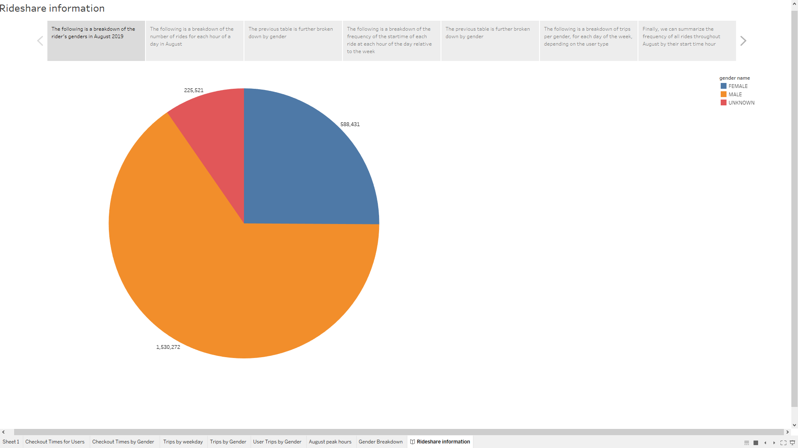
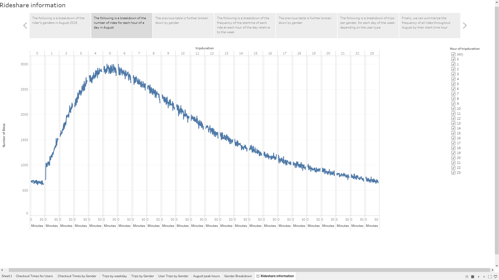
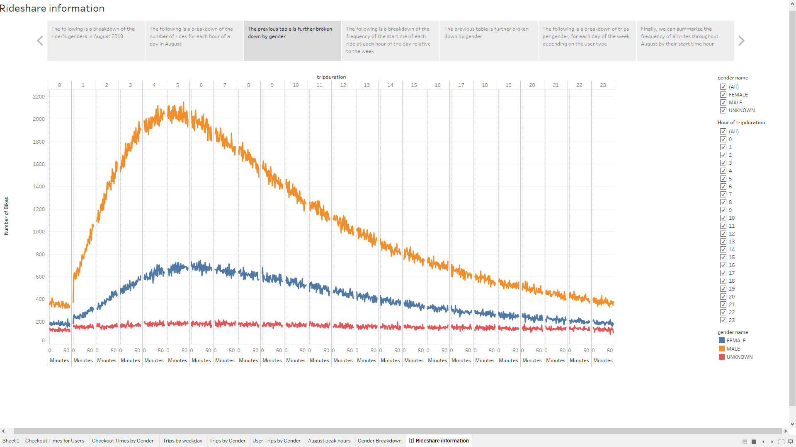
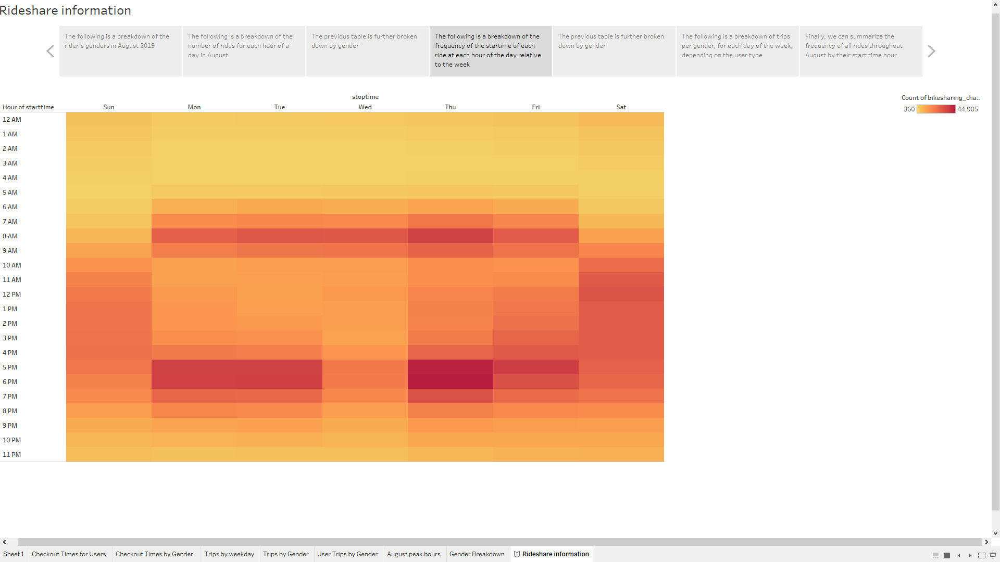
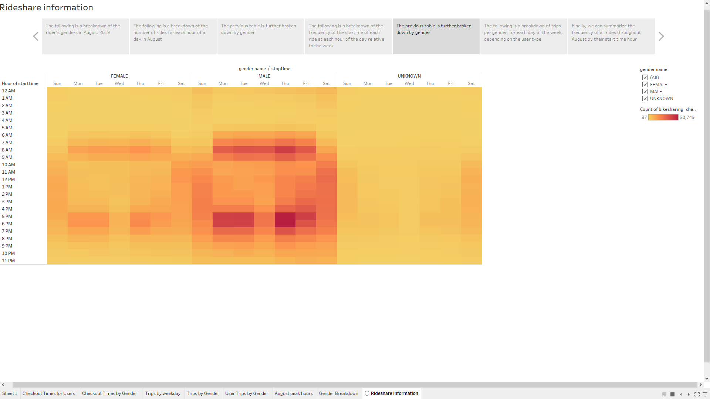
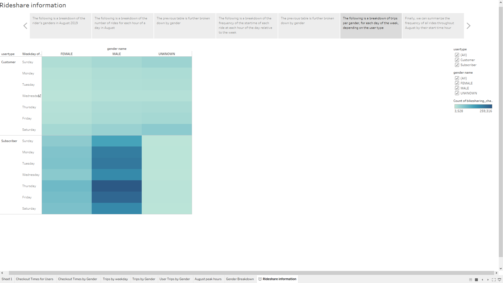
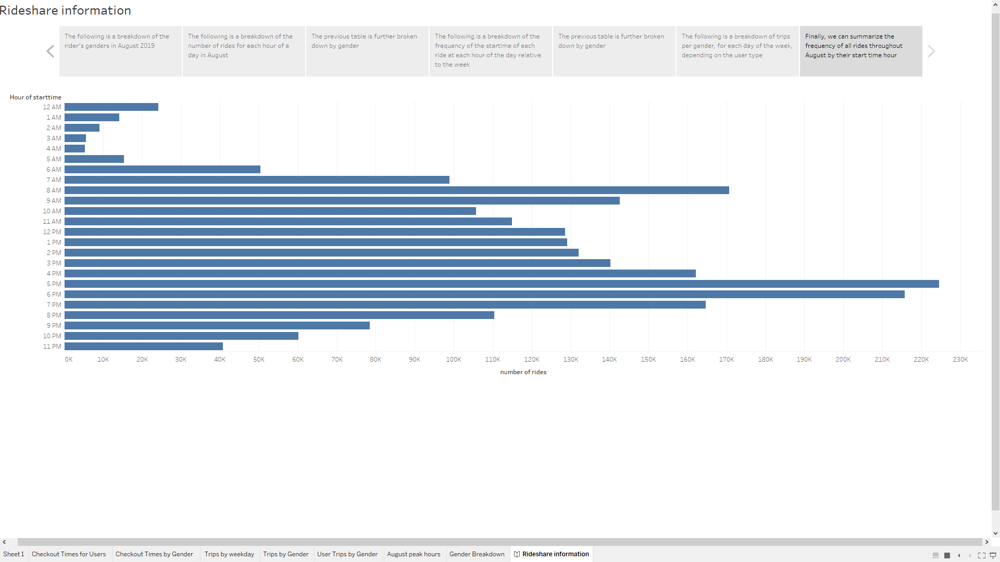

# Bikesharing analysis
## Overview of analysis
This analysis was created in order to breakdown bikesharing data in August 2019 in New York in order to get relevant information to help our own bikesharing venture in Des Moines. 

## Results
Here is the link to the analysis created in Tableau
[Link to Tableau](https://public.tableau.com/profile/ziye.zhang#!/vizhome/Tableau_challenge_16012590947500/Rideshareinformation)

We can see through this analysis that the majority of riders in New York in August is male

We can see through this analysis that the most popular checkout time for users are between 4-6 minutes

We can see through this analysis that the most popular checkout time for users are between 4-6 minutes and are made by males

We can see through this analysis that trips are most frequently made on thursdays between 5-7 PM

We can see through this analysis that trips are most frequently made on thursdays between 5-7 PM and are made by males

We can see through this analysis that trips are most frequently made on thursdays by male subscribers

We can see through this analysis that overall, trips are most frequently made on thursdays between 5-7 PM

## Summary

We can conclude on a high-level that trips are mostly made by males during weekdays at peak hours when people get off work. 

There are two additional visualizations that can be performed to bring more information: 
1. The duration of the trip in relations to the coordinates of the trip, to determine if there are particular areas within the city that is prone to longer bike rides
2. The type of user in relations to the birth year of the user, to see if people in certain age groups are more prone to become subscribers that otheres

